<div align="center">
  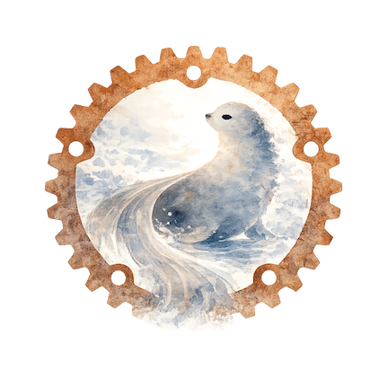
</div>

# Selkie

**⚠️ Still actively under development ⚠️**

A 100% Rust implementation of the [Mermaid](https://mermaid.js.org/) diagram parser and renderer.

Try it in your browser: **[btucker.github.io/selkie](https://btucker.github.io/selkie/)**

## About

Selkie aims to provide a fast, native alternative to Mermaid.js for parsing and rendering diagrams. The entire implementation is written in Rust, with no JavaScript dependencies at runtime.

This project has been built entirely with coding agents, mostly [Claude Code](https://docs.anthropic.com/en/docs/claude-code). Development is guided by an [evaluation system](EVAL.md) that compares Selkie's output against the reference Mermaid.js implementation, providing automated feedback on structural and visual parity. The eval system serves as the primary guidance mechanism—agents run `selkie eval` to see prioritized issues, investigate differences by comparing generated SVGs against reference implementations, and verify that changes improve scores without introducing regressions. This creates a tight feedback loop where the agent can autonomously identify what needs work and measure its progress.

## Performance

Selkie provides significant performance improvements over mermaid-js in both CLI and browser environments.

### CLI Benchmark

Compared to [mermaid-cli](https://github.com/mermaid-js/mermaid-cli) (`mmdc`):

| Diagram | mmdc | Selkie |
|---------|------|--------|
| Simple flowchart (5 nodes) | 1.53s | 6ms |
| Medium flowchart (15 nodes) | 1.54s | 7ms |
| Sequence diagram (4 actors) | 1.52s | 5ms |
| Class diagram (5 classes) | 1.55s | 5ms |
| Large flowchart (100 nodes) | 1.82s | 27ms |

_CLI-to-CLI comparison. Median of 5 runs after 2 warmup runs._

The dramatic speedup comes from avoiding the browser entirely—mermaid-cli spawns Puppeteer + Chromium for each render.

### Browser Benchmark

For client-side rendering, Selkie compiles to WebAssembly. Both run in the same Chromium browser for a fair comparison. [Run it yourself →](https://btucker.github.io/selkie/benchmark.html)

| Diagram | Mermaid.js | Selkie WASM |
|---------|------------|-------------|
| Simple flowchart (5 nodes) | 10ms | 1ms |
| Medium flowchart (15 nodes) | 21ms | 1.6ms |
| Sequence diagram (4 actors) | 4.5ms | 0.3ms |
| Class diagram (5 classes) | 16ms | 0.5ms |
| State diagram (8 states) | 22ms | 0.75ms |
| Pie chart (5 slices) | 1.6ms | 0.1ms |

_Median of 10 runs after 2 warmup runs. Chromium via Playwright._

**Bundle Size:**

| | Uncompressed | Gzipped |
|---|---|---|
| Selkie (WASM + JS) | ~3.0 MB | ~725 KB |
| Mermaid.js | ~2.6 MB | ~770 KB |

## Credits

Selkie could not exist without all the human effort that has gone into these excellent projects:

- **[Mermaid](https://github.com/mermaid-js/mermaid)** - The original JavaScript diagramming library that defines the syntax and rendering we aim to match
- **[Dagre](https://github.com/dagrejs/dagre)** - Graph layout algorithms that inspire our layout engine
- **[ELK](https://github.com/kieler/elkjs)** - Eclipse Layout Kernel, providing additional layout strategies

## Supported Diagram Types

Selkie supports parsing and rendering for all major Mermaid diagram types.

| Type | Example |
|------|---------|
| **Flowchart** | <a href="https://btucker.github.io/selkie/#Zmxvd2NoYXJ0JTIwVEIlMEElMjAlMjAlMjAlMjBzdWJncmFwaCUyMEZyb250ZW5kJTVCJTIyRnJvbnRlbmQlMjBMYXllciUyMiU1RCUwQSUyMCUyMCUyMCUyMCUyMCUyMCUyMCUyMFVJJTVCV2ViJTIwSW50ZXJmYWNlJTVEJTBBJTIwJTIwJTIwJTIwJTIwJTIwJTIwJTIwTW9iaWxlJTVCTW9iaWxlJTIwQXBwJTVEJTBBJTIwJTIwJTIwJTIwJTIwJTIwJTIwJTIwQ0xJJTVCQ0xJJTIwVG9vbCU1RCUwQSUyMCUyMCUyMCUyMGVuZCUwQSUwQSUyMCUyMCUyMCUyMHN1YmdyYXBoJTIwQVBJJTVCJTIyQVBJJTIwR2F0ZXdheSUyMiU1RCUwQSUyMCUyMCUyMCUyMCUyMCUyMCUyMCUyMEF1dGglN0JBdXRoZW50aWNhdGlvbiU3RCUwQSUyMCUyMCUyMCUyMCUyMCUyMCUyMCUyMFJhdGUlNUJSYXRlJTIwTGltaXRlciU1RCUwQSUyMCUyMCUyMCUyMCUyMCUyMCUyMCUyMENhY2hlJTVCJTI4UmVkaXMlMjBDYWNoZSUyOSU1RCUwQSUyMCUyMCUyMCUyMGVuZCUwQSUwQSUyMCUyMCUyMCUyMHN1YmdyYXBoJTIwU2VydmljZXMlNUIlMjJNaWNyb3NlcnZpY2VzJTIyJTVEJTBBJTIwJTIwJTIwJTIwJTIwJTIwJTIwJTIwVXNlclN2YyU1QlVzZXIlMjBTZXJ2aWNlJTVEJTBBJTIwJTIwJTIwJTIwJTIwJTIwJTIwJTIwT3JkZXJTdmMlNUJPcmRlciUyMFNlcnZpY2UlNUQlMEElMjAlMjAlMjAlMjAlMjAlMjAlMjAlMjBQYXltZW50U3ZjJTVCUGF5bWVudCUyMFNlcnZpY2UlNUQlMEElMjAlMjAlMjAlMjAlMjAlMjAlMjAlMjBOb3RpZnlTdmMlNUJOb3RpZmljYXRpb24lMjBTZXJ2aWNlJTVEJTBBJTIwJTIwJTIwJTIwZW5kJTBBJTBBJTIwJTIwJTIwJTIwc3ViZ3JhcGglMjBEYXRhJTVCJTIyRGF0YSUyMExheWVyJTIyJTVEJTBBJTIwJTIwJTIwJTIwJTIwJTIwJTIwJTIwREIlNUIlMjhQb3N0Z3JlU1FMJTI5JTVEJTBBJTIwJTIwJTIwJTIwJTIwJTIwJTIwJTIwU2VhcmNoJTVCJTI4RWxhc3RpY3NlYXJjaCUyOSU1RCUwQSUyMCUyMCUyMCUyMCUyMCUyMCUyMCUyMFF1ZXVlJTVCJTI4TWVzc2FnZSUyMFF1ZXVlJTI5JTVEJTBBJTIwJTIwJTIwJTIwZW5kJTBBJTBBJTIwJTIwJTIwJTIwVUklMjAtLSUzRSUyMEF1dGglMEElMjAlMjAlMjAlMjBNb2JpbGUlMjAtLSUzRSUyMEF1dGglMEElMjAlMjAlMjAlMjBDTEklMjAtLSUzRSUyMEF1dGglMEElMjAlMjAlMjAlMjBBdXRoJTIwLS0lM0UlN0NWYWxpZCU3QyUyMFJhdGUlMEElMjAlMjAlMjAlMjBBdXRoJTIwLS0lM0UlN0NJbnZhbGlkJTdDJTIwUmVqZWN0JTVCUmVqZWN0JTIwUmVxdWVzdCU1RCUwQSUyMCUyMCUyMCUyMFJhdGUlMjAtLSUzRSUyMENhY2hlJTBBJTIwJTIwJTIwJTIwQ2FjaGUlMjAtLSUzRSU3Q0NhY2hlJTIwSGl0JTdDJTIwUmVzcG9uc2UlNUJSZXR1cm4lMjBSZXNwb25zZSU1RCUwQSUyMCUyMCUyMCUyMENhY2hlJTIwLS0lM0UlN0NDYWNoZSUyME1pc3MlN0MlMjBVc2VyU3ZjJTBBJTBBJTIwJTIwJTIwJTIwVXNlclN2YyUyMC0tJTNFJTIwREIlMEElMjAlMjAlMjAlMjBVc2VyU3ZjJTIwLS0lM0UlMjBTZWFyY2glMEElMjAlMjAlMjAlMjBPcmRlclN2YyUyMC0tJTNFJTIwREIlMEElMjAlMjAlMjAlMjBPcmRlclN2YyUyMC0tJTNFJTIwUXVldWUlMEElMjAlMjAlMjAlMjBQYXltZW50U3ZjJTIwLS0lM0UlMjBEQiUwQSUyMCUyMCUyMCUyMFBheW1lbnRTdmMlMjAtLSUzRSUyME5vdGlmeVN2YyUwQSUyMCUyMCUyMCUyME5vdGlmeVN2YyUyMC0tJTNFJTIwUXVldWUlMEElMEElMjAlMjAlMjAlMjBRdWV1ZSUyMC0tJTNFJTIwRW1haWxXb3JrZXIlNUJFbWFpbCUyMFdvcmtlciU1RCUwQSUyMCUyMCUyMCUyMFF1ZXVlJTIwLS0lM0UlMjBTTVNXb3JrZXIlNUJTTVMlMjBXb3JrZXIlNUQlMEE="></a> |
| **Sequence** | <a href="https://btucker.github.io/selkie/#c2VxdWVuY2VEaWFncmFtJTBBJTIwJTIwJTIwJTIwcGFydGljaXBhbnQlMjBBJTIwYXMlMjBBbGljZSUwQSUyMCUyMCUyMCUyMHBhcnRpY2lwYW50JTIwQiUyMGFzJTIwQm9iJTBBJTIwJTIwJTIwJTIwcGFydGljaXBhbnQlMjBDJTIwYXMlMjBTZXJ2ZXIlMEElMjAlMjAlMjAlMjBBLSUzRSUzRUIlM0ElMjBIZWxsbyUyMEJvYiUyMSUwQSUyMCUyMCUyMCUyMEItLSUzRSUzRUElM0ElMjBIaSUyMEFsaWNlJTIxJTBBJTIwJTIwJTIwJTIwTm90ZSUyMG92ZXIlMjBBJTJDQiUzQSUyMEF1dGhlbnRpY2F0aW9uJTBBJTIwJTIwJTIwJTIwQS0lM0UlM0UlMkJDJTNBJTIwTG9naW4lMjByZXF1ZXN0JTBBJTIwJTIwJTIwJTIwQy0tJTNFJTNFLUElM0ElMjBUb2tlbiUwQSUyMCUyMCUyMCUyMEEtJTNFJTNFQiUzQSUyMEhvdyUyMGFyZSUyMHlvdSUzRiUwQSUyMCUyMCUyMCUyMEItLSUzRSUzRUElM0ElMjBJJTI3bSUyMGdvb2QlMkMlMjB0aGFua3MlMjElMEElMjAlMjAlMjAlMjBOb3RlJTIwcmlnaHQlMjBvZiUyMEIlM0ElMjBCb2IlMjB0aGlua3MlMEE="></a> |
| **Class** | <a href="https://btucker.github.io/selkie/#Y2xhc3NEaWFncmFtJTBBJTIwJTIwJTIwJTIwQW5pbWFsJTIwJTNDJTdDLS0lMjBEdWNrJTBBJTIwJTIwJTIwJTIwQW5pbWFsJTIwJTNDJTdDLS0lMjBGaXNoJTBBJTIwJTIwJTIwJTIwQW5pbWFsJTIwJTNDJTdDLS0lMjBaZWJyYSUwQSUyMCUyMCUyMCUyMEFuaW1hbCUyMCUzQSUyMCUyQmludCUyMGFnZSUwQSUyMCUyMCUyMCUyMEFuaW1hbCUyMCUzQSUyMCUyQlN0cmluZyUyMGdlbmRlciUwQSUyMCUyMCUyMCUyMEFuaW1hbCUzQSUyMCUyQmlzTWFtbWFsJTI4JTI5JTBBJTIwJTIwJTIwJTIwQW5pbWFsJTNBJTIwJTJCbWF0ZSUyOCUyOSUwQSUyMCUyMCUyMCUyMGNsYXNzJTIwRHVjayU3QiUwQSUyMCUyMCUyMCUyMCUyMCUyMCUyMCUyMCUyQlN0cmluZyUyMGJlYWtDb2xvciUwQSUyMCUyMCUyMCUyMCUyMCUyMCUyMCUyMCUyQnN3aW0lMjglMjklMEElMjAlMjAlMjAlMjAlMjAlMjAlMjAlMjAlMkJxdWFjayUyOCUyOSUwQSUyMCUyMCUyMCUyMCU3RCUwQSUyMCUyMCUyMCUyMGNsYXNzJTIwRmlzaCU3QiUwQSUyMCUyMCUyMCUyMCUyMCUyMCUyMCUyMC1pbnQlMjBzaXplSW5GZWV0JTBBJTIwJTIwJTIwJTIwJTIwJTIwJTIwJTIwLWNhbkVhdCUyOCUyOSUwQSUyMCUyMCUyMCUyMCU3RCUwQSUyMCUyMCUyMCUyMGNsYXNzJTIwWmVicmElN0IlMEElMjAlMjAlMjAlMjAlMjAlMjAlMjAlMjAlMkJib29sJTIwaXNfd2lsZCUwQSUyMCUyMCUyMCUyMCUyMCUyMCUyMCUyMCUyQnJ1biUyOCUyOSUwQSUyMCUyMCUyMCUyMCU3RCUwQSUyMCUyMCUyMCUyMER1Y2slMjAlMjIxJTIyJTIwJTJBLS0lMjAlMjJtYW55JTIyJTIwRWdnJTIwJTNBJTIwaGFzJTBB"></a> |
| **State** |  |
| **ER** | <a href="https://btucker.github.io/selkie/#ZXJEaWFncmFtJTBBJTIwJTIwJTIwJTIwQ1VTVE9NRVIlMjAlN0MlN0MtLW8lN0IlMjBPUkRFUiUyMCUzQSUyMHBsYWNlcyUwQSUyMCUyMCUyMCUyME9SREVSJTIwJTdDJTdDLS0lN0MlN0IlMjBMSU5FLUlURU0lMjAlM0ElMjBjb250YWlucyUwQSUyMCUyMCUyMCUyMFBST0RVQ1QlMjAlN0MlN0MtLW8lN0IlMjBMSU5FLUlURU0lMjAlM0ElMjBpbmNsdWRlcyUwQSUyMCUyMCUyMCUyMENVU1RPTUVSJTIwJTdCJTBBJTIwJTIwJTIwJTIwJTIwJTIwJTIwJTIwc3RyaW5nJTIwbmFtZSUwQSUyMCUyMCUyMCUyMCUyMCUyMCUyMCUyMHN0cmluZyUyMGVtYWlsJTIwUEslMEElMjAlMjAlMjAlMjAlMjAlMjAlMjAlMjBzdHJpbmclMjBhZGRyZXNzJTBBJTIwJTIwJTIwJTIwJTdEJTBBJTIwJTIwJTIwJTIwT1JERVIlMjAlN0IlMEElMjAlMjAlMjAlMjAlMjAlMjAlMjAlMjBpbnQlMjBvcmRlck51bWJlciUyMFBLJTBBJTIwJTIwJTIwJTIwJTIwJTIwJTIwJTIwZGF0ZSUyMG9yZGVyRGF0ZSUwQSUyMCUyMCUyMCUyMCUyMCUyMCUyMCUyMHN0cmluZyUyMHN0YXR1cyUwQSUyMCUyMCUyMCUyMCU3RCUwQSUyMCUyMCUyMCUyMFBST0RVQ1QlMjAlN0IlMEElMjAlMjAlMjAlMjAlMjAlMjAlMjAlMjBpbnQlMjBpZCUyMFBLJTBBJTIwJTIwJTIwJTIwJTIwJTIwJTIwJTIwc3RyaW5nJTIwbmFtZSUwQSUyMCUyMCUyMCUyMCUyMCUyMCUyMCUyMGZsb2F0JTIwcHJpY2UlMEElMjAlMjAlMjAlMjAlN0QlMEE="></a> |
| **Gantt** | <a href="https://btucker.github.io/selkie/#Z2FudHQlMEElMjAlMjAlMjAlMjB0aXRsZSUyMFByb2plY3QlMjBUaW1lbGluZSUwQSUyMCUyMCUyMCUyMGRhdGVGb3JtYXQlMjBZWVlZLU1NLUREJTBBJTIwJTIwJTIwJTIwc2VjdGlvbiUyMFBsYW5uaW5nJTBBJTIwJTIwJTIwJTIwUmVxdWlyZW1lbnRzJTIwJTNBYTElMkMlMjAyMDI0LTAxLTAxJTJDJTIwN2QlMEElMjAlMjAlMjAlMjBEZXNpZ24lMjAlMjAlMjAlMjAlMjAlMjAlM0FhMiUyQyUyMGFmdGVyJTIwYTElMkMlMjA1ZCUwQSUyMCUyMCUyMCUyMHNlY3Rpb24lMjBEZXZlbG9wbWVudCUwQSUyMCUyMCUyMCUyMEJhY2tlbmQlMjAlMjAlMjAlMjAlMjAlM0Fjcml0JTJDJTIwYjElMkMlMjBhZnRlciUyMGEyJTJDJTIwMTBkJTBBJTIwJTIwJTIwJTIwRnJvbnRlbmQlMjAlMjAlMjAlMjAlM0FiMiUyQyUyMGFmdGVyJTIwYTIlMkMlMjA4ZCUwQSUyMCUyMCUyMCUyMEFQSSUyMEludGVncmF0aW9uJTIwJTNBYjMlMkMlMjBhZnRlciUyMGIxJTJDJTIwM2QlMEElMjAlMjAlMjAlMjBzZWN0aW9uJTIwVGVzdGluZyUwQSUyMCUyMCUyMCUyMFVuaXQlMjBUZXN0cyUyMCUyMCUzQWMxJTJDJTIwYWZ0ZXIlMjBiMiUyQyUyMDNkJTBBJTIwJTIwJTIwJTIwUUElMjAlMjAlMjAlMjAlMjAlMjAlMjAlMjAlMjAlMjAlM0FjMiUyQyUyMGFmdGVyJTIwYjMlMkMlMjA1ZCUwQQ=="></a> |
| **Pie** | <a href="https://btucker.github.io/selkie/#cGllJTIwdGl0bGUlMjBQcm9qZWN0JTIwRGlzdHJpYnV0aW9uJTBBJTIwJTIwJTIwJTIwJTIyRGV2ZWxvcG1lbnQlMjIlMjAlM0ElMjA0MCUwQSUyMCUyMCUyMCUyMCUyMlRlc3RpbmclMjIlMjAlM0ElMjAyNSUwQSUyMCUyMCUyMCUyMCUyMkRvY3VtZW50YXRpb24lMjIlMjAlM0ElMjAxNSUwQSUyMCUyMCUyMCUyMCUyMkRlc2lnbiUyMiUyMCUzQSUyMDIwJTBB"></a> |
| **Architecture** | <a href="https://btucker.github.io/selkie/#YXJjaGl0ZWN0dXJlLWJldGElMEElMjAlMjAlMjAlMjB0aXRsZSUyMENvbXBsZXglMjBBcmNoaXRlY3R1cmUlMEElMEElMjAlMjAlMjAlMjBncm91cCUyMGVkZ2UlMjhjbG91ZCUyOSU1QkVkZ2UlNUQlMEElMjAlMjAlMjAlMjBncm91cCUyMHBsYXRmb3JtJTI4c2VydmVyJTI5JTVCUGxhdGZvcm0lNUQlMEElMjAlMjAlMjAlMjBncm91cCUyMGRhdGElMjhkYXRhYmFzZSUyOSU1QkRhdGElNUQlMEElMjAlMjAlMjAlMjBncm91cCUyMG9ic2VydmFiaWxpdHklMjhkaXNrJTI5JTVCT2JzZXJ2YWJpbGl0eSU1RCUyMGluJTIwcGxhdGZvcm0lMEElMEElMjAlMjAlMjAlMjBzZXJ2aWNlJTIwZ2F0ZXdheSUyOGludGVybmV0JTI5JTVCR2F0ZXdheSU1RCUyMGluJTIwZWRnZSUwQSUyMCUyMCUyMCUyMHNlcnZpY2UlMjB3ZWIlMjhpbnRlcm5ldCUyOSU1QldlYiUyMEFwcCU1RCUyMGluJTIwZWRnZSUwQSUyMCUyMCUyMCUyMHNlcnZpY2UlMjBhcGklMjhzZXJ2ZXIlMjklNUJBUEklNUQlMjBpbiUyMGVkZ2UlMEElMjAlMjAlMjAlMjBzZXJ2aWNlJTIwYXV0aCUyOHNlcnZlciUyOSU1QkF1dGglNUQlMjBpbiUyMGVkZ2UlMEElMEElMjAlMjAlMjAlMjBzZXJ2aWNlJTIwY29yZSUyOHNlcnZlciUyOSU1QkNvcmUlNUQlMjBpbiUyMHBsYXRmb3JtJTBBJTIwJTIwJTIwJTIwc2VydmljZSUyMGNhY2hlJTI4ZGlzayUyOSU1QkNhY2hlJTVEJTIwaW4lMjBwbGF0Zm9ybSUwQSUyMCUyMCUyMCUyMHNlcnZpY2UlMjBxdWV1ZSUyOHNlcnZlciUyOSU1QlF1ZXVlJTVEJTIwaW4lMjBwbGF0Zm9ybSUwQSUyMCUyMCUyMCUyMGp1bmN0aW9uJTIwaHViJTIwaW4lMjBwbGF0Zm9ybSUwQSUwQSUyMCUyMCUyMCUyMHNlcnZpY2UlMjBkYiUyOGRhdGFiYXNlJTI5JTVCTWFpbiUyMERCJTVEJTIwaW4lMjBkYXRhJTBBJTIwJTIwJTIwJTIwc2VydmljZSUyMHNlYXJjaCUyOGRpc2slMjklNUJTZWFyY2glNUQlMjBpbiUyMGRhdGElMEElMEElMjAlMjAlMjAlMjBzZXJ2aWNlJTIwbWV0cmljcyUyOGRpc2slMjklNUJNZXRyaWNzJTVEJTIwaW4lMjBvYnNlcnZhYmlsaXR5JTBBJTIwJTIwJTIwJTIwc2VydmljZSUyMGxvZ3MlMjhkaXNrJTI5JTVCTG9ncyU1RCUyMGluJTIwb2JzZXJ2YWJpbGl0eSUwQSUwQSUyMCUyMCUyMCUyMGdhdGV3YXklM0FSJTIwLS0lM0UlMjBMJTNBd2ViJTBBJTIwJTIwJTIwJTIwd2ViJTNBUiUyMC0tJTNFJTIwTCUzQWFwaSUwQSUyMCUyMCUyMCUyMGFwaSUzQVIlMjAtLSUyMEwlM0FhdXRoJTBBJTIwJTIwJTIwJTIwYXBpJTdCZ3JvdXAlN0QlM0FCJTIwLSU1Qmp3dCU1RC0lMjBUJTNBY29yZSU3Qmdyb3VwJTdEJTBBJTIwJTIwJTIwJTIwY29yZSUzQUwlMjAtLSUyMFIlM0FxdWV1ZSUwQSUyMCUyMCUyMCUyMGNvcmUlM0FSJTIwLS0lMjBMJTNBY2FjaGUlMEElMjAlMjAlMjAlMjBjb3JlJTNBQiUyMC0tJTIwVCUzQWh1YiUwQSUyMCUyMCUyMCUyMGh1YiUzQVIlMjAtLSUyMEwlM0FtZXRyaWNzJTBBJTIwJTIwJTIwJTIwbWV0cmljcyUzQVIlMjAtLSUyMEwlM0Fsb2dzJTBBJTIwJTIwJTIwJTIwY29yZSU3Qmdyb3VwJTdEJTNBUiUyMC0lNUJzcWwlNUQtJTIwTCUzQWRiJTdCZ3JvdXAlN0QlMEElMjAlMjAlMjAlMjBkYiUzQUIlMjAtLSUyMFQlM0FzZWFyY2glMEElMjAlMjAlMjAlMjBjYWNoZSU3Qmdyb3VwJTdEJTNBQiUyMC0lNUJyZXBsaWNhdGUlNUQtJTIwUiUzQWRiJTdCZ3JvdXAlN0QlMEE="></a> |
| **Git Graph** | <a href="https://btucker.github.io/selkie/#Z2l0R3JhcGglMEElMjAlMjAlMjAlMjBjb21taXQlMjBpZCUzQSUyMkElMjIlMEElMjAlMjAlMjAlMjBjb21taXQlMjBpZCUzQSUyMkIlMjIlMEElMjAlMjAlMjAlMjBicmFuY2glMjBmZWF0dXJlJTBBJTIwJTIwJTIwJTIwY2hlY2tvdXQlMjBmZWF0dXJlJTBBJTIwJTIwJTIwJTIwY29tbWl0JTIwaWQlM0ElMjJDJTIyJTBBJTIwJTIwJTIwJTIwY29tbWl0JTIwaWQlM0ElMjJEJTIyJTBBJTIwJTIwJTIwJTIwY2hlY2tvdXQlMjBtYWluJTBBJTIwJTIwJTIwJTIwY29tbWl0JTIwaWQlM0ElMjJFJTIyJTBBJTIwJTIwJTIwJTIwbWVyZ2UlMjBmZWF0dXJlJTBBJTIwJTIwJTIwJTIwYnJhbmNoJTIwaG90Zml4JTBBJTIwJTIwJTIwJTIwY2hlY2tvdXQlMjBob3RmaXglMEElMjAlMjAlMjAlMjBjb21taXQlMjBpZCUzQSUyMkYlMjIlMEElMjAlMjAlMjAlMjBjaGVja291dCUyMG1haW4lMEElMjAlMjAlMjAlMjBtZXJnZSUyMGhvdGZpeCUwQSUyMCUyMCUyMCUyMGNvbW1pdCUyMGlkJTNBJTIyRyUyMiUwQSUyMCUyMCUyMCUyMGJyYW5jaCUyMHJlbGVhc2UlMEElMjAlMjAlMjAlMjBjaGVja291dCUyMHJlbGVhc2UlMEElMjAlMjAlMjAlMjBjb21taXQlMjBpZCUzQSUyMkglMjIlMEElMjAlMjAlMjAlMjBjb21taXQlMjBpZCUzQSUyMkklMjIlMEElMjAlMjAlMjAlMjBjaGVja291dCUyMG1haW4lMEElMjAlMjAlMjAlMjBtZXJnZSUyMHJlbGVhc2UlMEE="></a> |
| **Requirement** | <a href="https://btucker.github.io/selkie/#cmVxdWlyZW1lbnREaWFncmFtJTBBJTBBJTIwJTIwJTIwJTIwcmVxdWlyZW1lbnQlMjB0ZXN0X3JlcSUyMCU3QiUwQSUyMCUyMCUyMCUyMGlkJTNBJTIwMSUwQSUyMCUyMCUyMCUyMHRleHQlM0ElMjB0aGUlMjB0ZXN0JTIwdGV4dC4lMEElMjAlMjAlMjAlMjByaXNrJTNBJTIwaGlnaCUwQSUyMCUyMCUyMCUyMHZlcmlmeW1ldGhvZCUzQSUyMHRlc3QlMEElMjAlMjAlMjAlMjAlN0QlMEElMEElMjAlMjAlMjAlMjBmdW5jdGlvbmFsUmVxdWlyZW1lbnQlMjB0ZXN0X3JlcTIlMjAlN0IlMEElMjAlMjAlMjAlMjBpZCUzQSUyMDEuMSUwQSUyMCUyMCUyMCUyMHRleHQlM0ElMjB0aGUlMjBzZWNvbmQlMjB0ZXN0JTIwdGV4dC4lMEElMjAlMjAlMjAlMjByaXNrJTNBJTIwbG93JTBBJTIwJTIwJTIwJTIwdmVyaWZ5bWV0aG9kJTNBJTIwaW5zcGVjdGlvbiUwQSUyMCUyMCUyMCUyMCU3RCUwQSUwQSUyMCUyMCUyMCUyMHBlcmZvcm1hbmNlUmVxdWlyZW1lbnQlMjB0ZXN0X3JlcTMlMjAlN0IlMEElMjAlMjAlMjAlMjBpZCUzQSUyMDEuMiUwQSUyMCUyMCUyMCUyMHRleHQlM0ElMjB0aGUlMjB0aGlyZCUyMHRlc3QlMjB0ZXh0LiUwQSUyMCUyMCUyMCUyMHJpc2slM0ElMjBtZWRpdW0lMEElMjAlMjAlMjAlMjB2ZXJpZnltZXRob2QlM0ElMjBkZW1vbnN0cmF0aW9uJTBBJTIwJTIwJTIwJTIwJTdEJTBBJTBBJTIwJTIwJTIwJTIwZWxlbWVudCUyMHRlc3RfZW50aXR5JTIwJTdCJTBBJTIwJTIwJTIwJTIwdHlwZSUzQSUyMHNpbXVsYXRpb24lMEElMjAlMjAlMjAlMjAlN0QlMEElMEElMjAlMjAlMjAlMjBlbGVtZW50JTIwdGVzdF9lbnRpdHkyJTIwJTdCJTBBJTIwJTIwJTIwJTIwdHlwZSUzQSUyMHdvcmQlMjBkb2MlMEElMjAlMjAlMjAlMjBkb2NSZWYlM0ElMjByZXFzL3Rlc3RfZW50aXR5JTBBJTIwJTIwJTIwJTIwJTdEJTBBJTBBJTIwJTIwJTIwJTIwdGVzdF9lbnRpdHklMjAtJTIwc2F0aXNmaWVzJTIwLSUzRSUyMHRlc3RfcmVxMiUwQSUyMCUyMCUyMCUyMHRlc3RfcmVxJTIwLSUyMHRyYWNlcyUyMC0lM0UlMjB0ZXN0X3JlcTIlMEElMjAlMjAlMjAlMjB0ZXN0X3JlcSUyMC0lMjBjb250YWlucyUyMC0lM0UlMjB0ZXN0X3JlcTMlMEElMjAlMjAlMjAlMjB0ZXN0X2VudGl0eTIlMjAtJTIwdmVyaWZpZXMlMjAtJTNFJTIwdGVzdF9yZXElMEE=">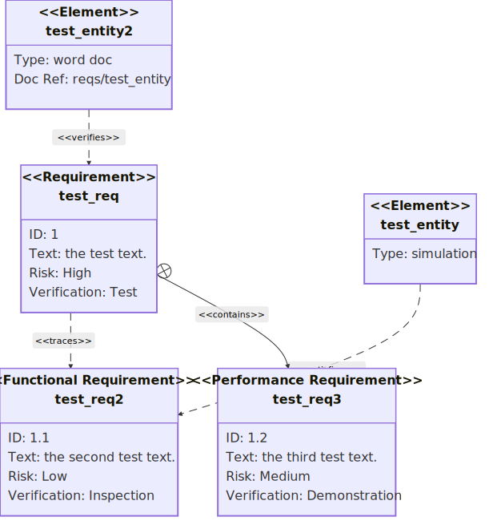</a> |
| **Quadrant** | <a href="https://btucker.github.io/selkie/#cXVhZHJhbnRDaGFydCUwQSUyMCUyMCUyMCUyMHRpdGxlJTIwUmVhY2glMjBhbmQlMjBFbmdhZ2VtZW50JTBBJTIwJTIwJTIwJTIweC1heGlzJTIwTG93JTIwUmVhY2glMjAtLSUzRSUyMEhpZ2glMjBSZWFjaCUwQSUyMCUyMCUyMCUyMHktYXhpcyUyMExvdyUyMEVuZ2FnZW1lbnQlMjAtLSUzRSUyMEhpZ2glMjBFbmdhZ2VtZW50JTBBJTIwJTIwJTIwJTIwcXVhZHJhbnQtMSUyMFdlJTIwc2hvdWxkJTIwZXhwYW5kJTBBJTIwJTIwJTIwJTIwcXVhZHJhbnQtMiUyME5lZWQlMjB0byUyMHByb21vdGUlMEElMjAlMjAlMjAlMjBxdWFkcmFudC0zJTIwUmUtZXZhbHVhdGUlMEElMjAlMjAlMjAlMjBxdWFkcmFudC00JTIwTWF5JTIwYmUlMjBpbXByb3ZlZCUwQSUyMCUyMCUyMCUyMENhbXBhaWduJTIwQSUzQSUyMCU1QjAuMyUyQyUyMDAuNiU1RCUwQSUyMCUyMCUyMCUyMENhbXBhaWduJTIwQiUzQSUyMCU1QjAuNDUlMkMlMjAwLjIzJTVEJTBBJTIwJTIwJTIwJTIwQ2FtcGFpZ24lMjBDJTNBJTIwJTVCMC41NyUyQyUyMDAuNjklNUQlMEElMjAlMjAlMjAlMjBDYW1wYWlnbiUyMEQlM0ElMjAlNUIwLjc4JTJDJTIwMC4zNCU1RCUwQSUyMCUyMCUyMCUyMENhbXBhaWduJTIwRSUzQSUyMCU1QjAuNDAlMkMlMjAwLjM0JTVEJTBBJTIwJTIwJTIwJTIwQ2FtcGFpZ24lMjBGJTNBJTIwJTVCMC4zNSUyQyUyMDAuNzglNUQ=">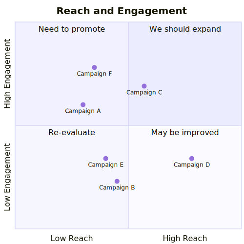</a> |
| **Mindmap** | 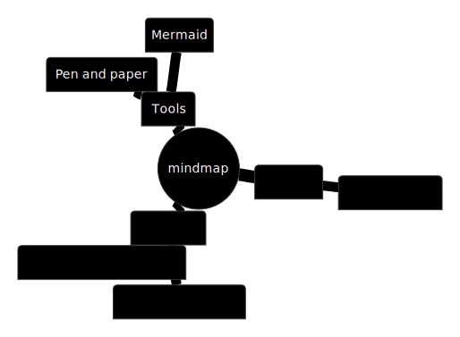 |
| **Timeline** | 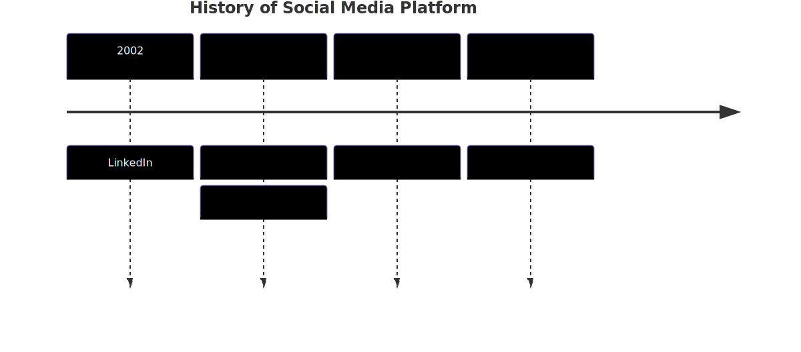 |
| **Sankey** | 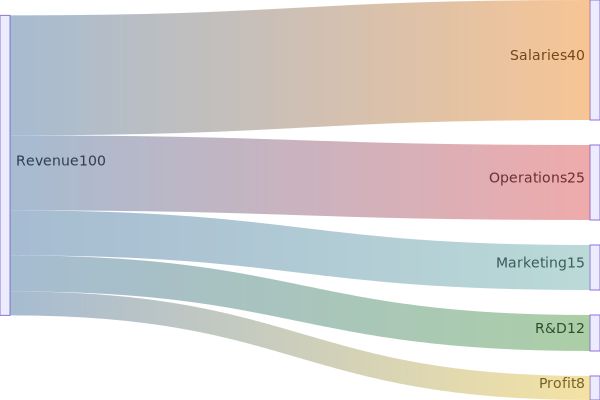 |
| **XY Chart** | 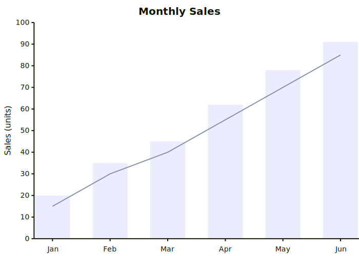 |
| **C4** | 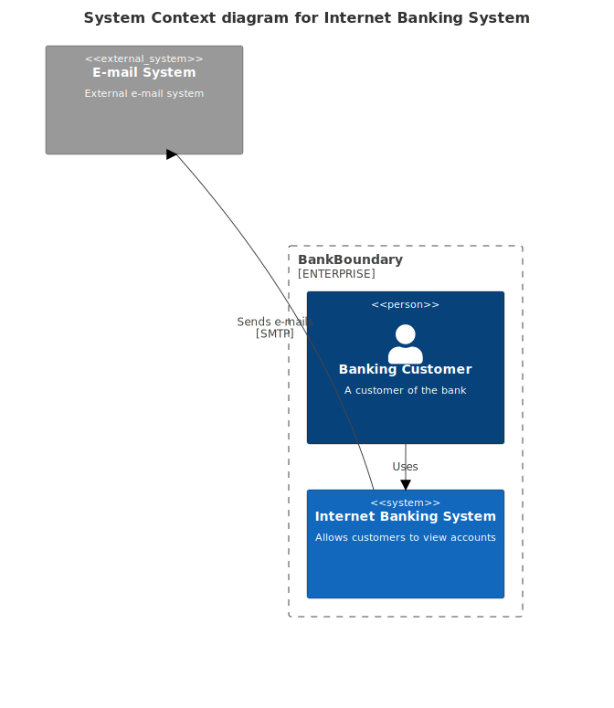 |
| **Journey** | 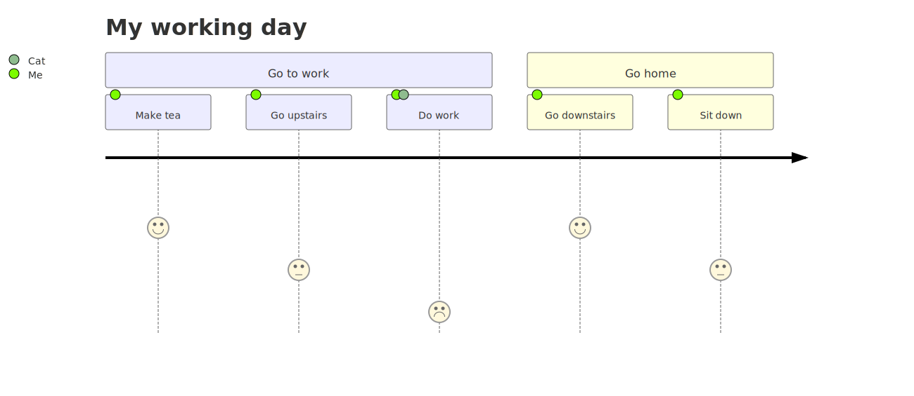 |
| **Radar** | 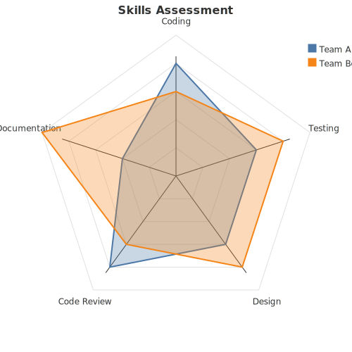 |
| **Block** |  |
| **Packet** | 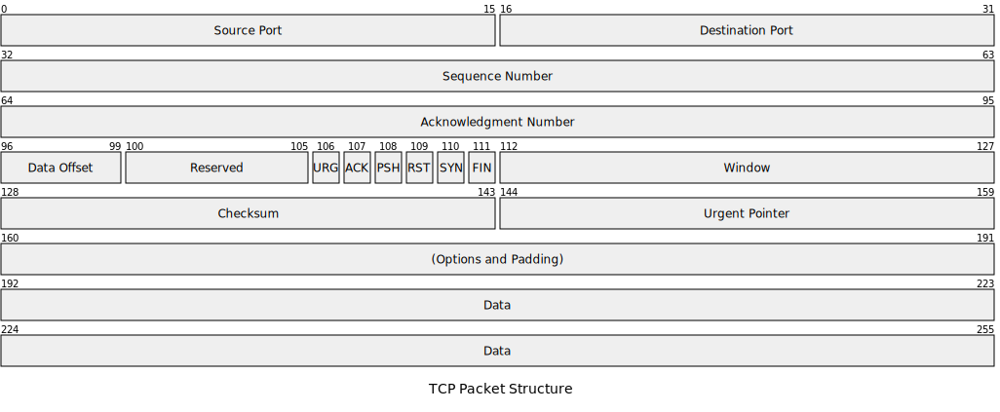 |
| **Treemap** | 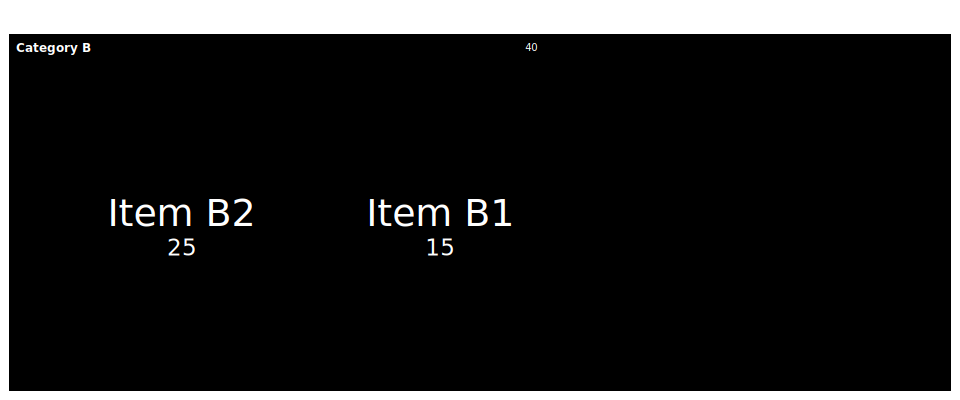 |
| **Kanban** | 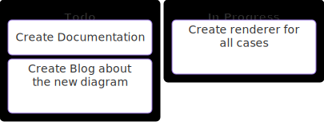 |

## Installation

```bash
cargo install selkie
```

Or build from source:

```bash
git clone https://github.com/btucker/selkie
cd selkie
cargo build --release
```

## Usage

### Command Line

```bash
# Render a diagram to SVG
selkie render -i diagram.mmd -o output.svg

# Shorthand (implicit render command)
selkie -i diagram.mmd -o output.svg

# Read from stdin, write to stdout
cat diagram.mmd | selkie -i - -o -

# Use a specific theme
selkie -i diagram.mmd -o output.svg --theme dark

# Output to PNG (requires 'png' feature)
selkie -i diagram.mmd -o output.png
```

### Evaluation System

Selkie includes a built-in evaluation system that compares output against Mermaid.js. See [EVAL.md](EVAL.md) for detailed documentation.

```bash
# Run evaluation with built-in samples
selkie eval

# Evaluate specific diagram types
selkie eval --type flowchart

# Output to custom directory
selkie eval -o ./reports

# Show detailed per-diagram diffs
selkie eval --verbose
```

The eval system generates an HTML report with:
- **Structural comparison** - Node/edge counts, labels, connections
- **Visual similarity** - SSIM-based image comparison
- **Side-by-side PNGs** - Selkie output next to Mermaid.js reference

Requires [Mermaid CLI](https://github.com/mermaid-js/mermaid-cli) for reference rendering (`npm install -g @mermaid-js/mermaid-cli`).

### As a Library

```rust
use mermaid::{parse, render};

fn main() -> Result<(), Box<dyn std::error::Error>> {
    let diagram_source = r#"
        flowchart LR
            A[Start] --> B{Decision}
            B -->|Yes| C[OK]
            B -->|No| D[Cancel]
    "#;

    let diagram = parse(diagram_source)?;
    let svg = render(&diagram)?;

    println!("{}", svg);
    Ok(())
}
```

### WebAssembly (Browser)

Selkie can be compiled to WebAssembly for client-side rendering in the browser. The WASM entrypoint mirrors the mermaid-js API (`initialize`, `parse`, and `render`) and also exposes `render_text` for a minimal wrapper.

```bash
# Build the WASM package (requires wasm-bindgen / wasm-pack)
wasm-pack build --target web --features wasm
```

```js
import init, { initialize, parse, render } from "./pkg/selkie.js";

await init();
initialize({ startOnLoad: false });
parse(`flowchart TD; A-->B;`);
const { svg } = render("diagram1", `flowchart TD; A-->B;`);
document.body.innerHTML = svg;
```

## Feature Flags

Selkie uses Cargo feature flags to enable optional functionality. This keeps the core library lightweight while allowing additional capabilities when needed.

### Default Features

| Feature | Description | Dependencies |
|---------|-------------|--------------|
| `cli` | Command line interface | [clap](https://crates.io/crates/clap) |

The CLI is enabled by default. To build only the library without CLI:

```bash
cargo build --release --no-default-features
```

### Output Formats

SVG output is always available with no additional dependencies:

```bash
selkie -i diagram.mmd -o output.svg
```

Additional output formats require feature flags:

| Feature | Format | Dependencies |
|---------|--------|--------------|
| _(none)_ | SVG | _(built-in)_ |
| `png` | PNG | [resvg](https://crates.io/crates/resvg) |
| `pdf` | PDF | [svg2pdf](https://crates.io/crates/svg2pdf), resvg |
| `kitty` | Terminal inline | resvg, [image](https://crates.io/crates/image), [base64](https://crates.io/crates/base64), libc, atty |
| `wasm` | WebAssembly bindings | [wasm-bindgen](https://crates.io/crates/wasm-bindgen) |
| `all-formats` | All of the above | All of the above |

### Usage Examples

```bash
# Build with PNG support
cargo build --release --features png

# Build with all output formats
cargo build --release --features all-formats

# Install with PDF support
cargo install selkie --features pdf

# Library only (no CLI, minimal dependencies)
cargo build --release --no-default-features
```

### Feature Details

#### `cli`

Provides the `selkie` command-line binary with subcommands for rendering and evaluation. Without this feature, only the library is built.

#### `png`

Enables PNG output via the `resvg` crate, a high-quality SVG rendering library. Use with:

```bash
selkie -i diagram.mmd -o output.png
```

#### `pdf`

Enables PDF output via `svg2pdf`. Useful for generating print-ready documents:

```bash
selkie -i diagram.mmd -o output.pdf
```

#### `kitty`

Enables inline image display in terminals that support the Kitty graphics protocol (Kitty, Ghostty, WezTerm). When enabled, diagrams can be rendered directly in the terminal:

```bash
selkie -i diagram.mmd  # Displays inline if terminal supports it
```

#### `wasm`

Enables WebAssembly bindings for browser usage. Build with:

```bash
wasm-pack build --target web --features wasm
```

#### `all-formats`

Convenience feature that enables `png`, `pdf`, and `kitty` together. Best for development or when you need maximum flexibility:

```bash
cargo install selkie --features all-formats
```

## Issue Tracking

This project uses [Microbeads](https://github.com/btucker/microbeads) for issue tracking - an AI-native issue tracker that lives directly in the repository. Issues are stored in `.beads/` and sync with git, making them accessible to both humans and AI coding agents.

```bash
# View available work
mb ready

# View issue details
mb show <issue-id>

# Update issue status
mb update <issue-id> --status in_progress
mb close <issue-id>

# Sync with remote
mb sync
```

## Development

This project follows test-driven development. Run the test suite:

```bash
cargo test
```

Run the evaluation to check parity with Mermaid.js:

```bash
cargo run -- eval
```

## License

MIT License - see [LICENSE](LICENSE) for details.
