# Selkie (Still actively under development)

A 100% Rust implementation of the [Mermaid](https://mermaid.js.org/) diagram parser and renderer.

## About

Selkie aims to provide a fast, native alternative to Mermaid.js for parsing and rendering diagrams. The entire implementation is written in Rust, with no JavaScript dependencies at runtime.

This project has been built entirely by [Claude Code](https://docs.anthropic.com/en/docs/claude-code). Development is guided by an evaluation system that compares Selkie's output against the reference Mermaid.js implementation, toward visual and structural parity.

## Performance

Selkie provides significant performance improvements compared to [mermaid-cli](https://github.com/mermaid-js/mermaid-cli) (`mmdc`).

### Benchmark Results

| Diagram | mmdc | Selkie | Speedup |
|---------|------|--------|---------|
| Simple flowchart (5 nodes) | 3.21s | 7ms | **476x** |
| Medium flowchart (15 nodes) | 4.89s | 8ms | **641x** |
| Large flowchart (100 nodes) | 3.67s | 18ms | **203x** |
| Sequence diagram (4 actors) | 2.86s | 6ms | **509x** |
| Class diagram (5 classes) | 4.10s | 5ms | **797x** |

_CLI-to-CLI comparison. Median of 5 runs after 2 warmup runs._

### Why Selkie is Faster

- **No JavaScript runtime**: Selkie is a native binary with ~5-20ms execution time
- **No browser**: mermaid-cli spawns Puppeteer + Chromium for each render (~3-5 seconds)
- **Efficient layout**: Rust implementation of graph layout algorithms

For simple diagrams, expect **200-800x speedup**. For complex diagrams (100+ nodes), the gap narrows to ~200x but Selkie remains dramatically faster.

## Credits

Selkie could not exist without all the human effort that has gone into these excellent projects:

- **[Mermaid](https://github.com/mermaid-js/mermaid)** - The original JavaScript diagramming library that defines the syntax and rendering we aim to match
- **[Dagre](https://github.com/dagrejs/dagre)** - Graph layout algorithms that inspire our layout engine
- **[ELK](https://github.com/kieler/elkjs)** - Eclipse Layout Kernel, providing additional layout strategies

## Supported Diagram Types

Selkie supports parsing for all major Mermaid diagram types. Rendering is complete for core diagram types, with others in progress.

<table>
<tr>
<th>Diagram Type</th>
<th>Mermaid.js</th>
<th>Selkie</th>
</tr>
<tr>
<td><strong>Flowchart</strong><br><sub>Nodes, edges, subgraphs</sub></td>
<td></td>
<td>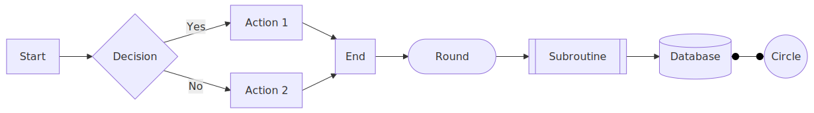</td>
</tr>
<tr>
<td><strong>Sequence</strong><br><sub>Participant interactions</sub></td>
<td>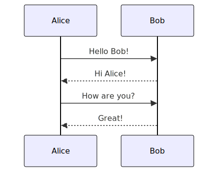</td>
<td>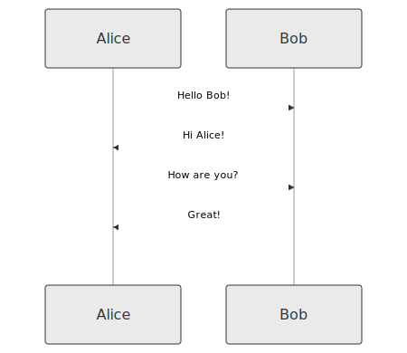</td>
</tr>
<tr>
<td><strong>Class</strong><br><sub>UML relationships</sub></td>
<td></td>
<td>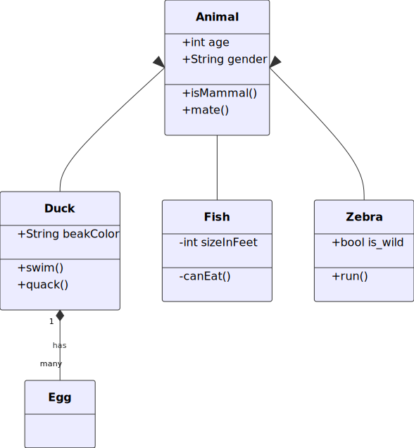</td>
</tr>
<tr>
<td><strong>State</strong><br><sub>State machines</sub></td>
<td></td>
<td>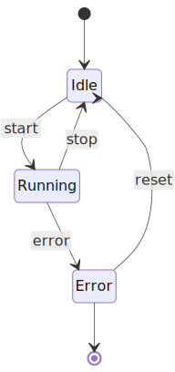</td>
</tr>
<tr>
<td><strong>ER Diagram</strong><br><sub>Data modeling</sub></td>
<td></td>
<td>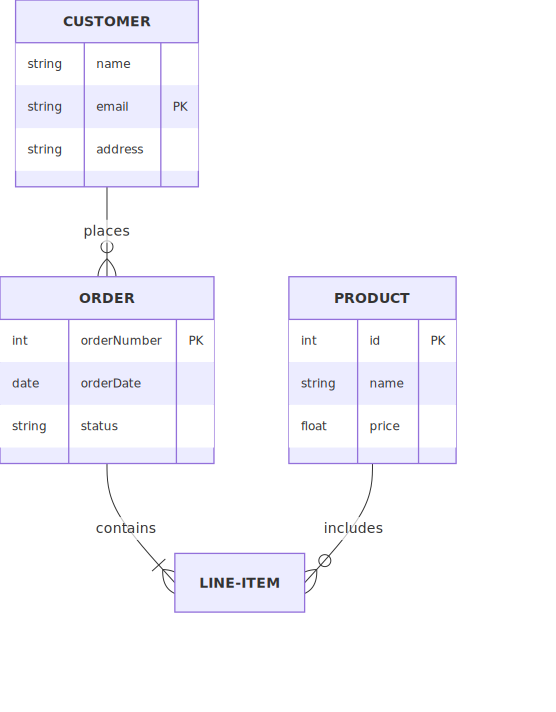</td>
</tr>
<tr>
<td><strong>Gantt</strong><br><sub>Project timelines</sub></td>
<td>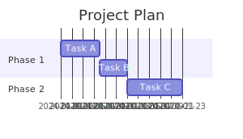</td>
<td>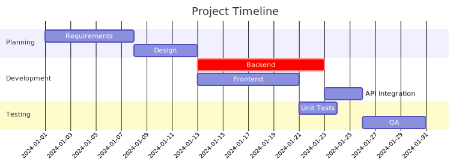</td>
</tr>
<tr>
<td><strong>Pie Chart</strong><br><sub>Proportional data</sub></td>
<td>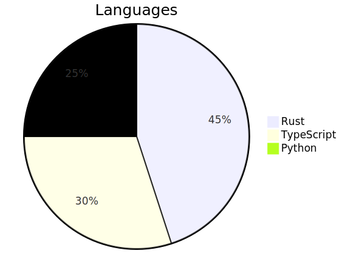</td>
<td>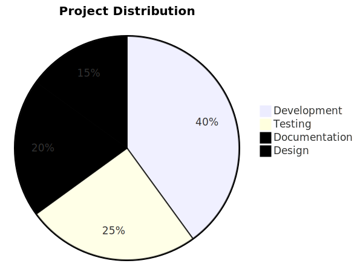</td>
</tr>
</table>

### Additional Diagram Types (Parser Only)

The following diagram types have parser support and rendering is in progress:

| Diagram Type | Description |
|--------------|-------------|
| Git Graph | Git branch visualization |
| Mindmap | Hierarchical mindmaps |
| Timeline | Timeline visualizations |
| Quadrant | Quadrant charts |
| XY Chart | Line and bar charts |
| Sankey | Flow diagrams with proportional widths |
| Requirement | Requirements diagrams |
| C4 | C4 architecture diagrams |
| Block | Block diagrams |
| Packet | Network packet diagrams |
| Kanban | Kanban boards |
| Architecture | Architecture diagrams |
| Journey | User journey maps |
| Radar | Radar/spider charts |
| Treemap | Treemap visualizations |

## Installation

```bash
cargo install selkie
```

Or build from source:

```bash
git clone https://github.com/btucker/selkie
cd selkie
cargo build --release
```

## Usage

### Command Line

```bash
# Render a diagram to SVG
selkie render -i diagram.mmd -o output.svg

# Shorthand (implicit render command)
selkie -i diagram.mmd -o output.svg

# Read from stdin, write to stdout
cat diagram.mmd | selkie -i - -o -

# Use a specific theme
selkie -i diagram.mmd -o output.svg --theme dark

# Output to PNG (requires 'png' feature)
selkie -i diagram.mmd -o output.png
```

### Evaluation System

Selkie includes a built-in evaluation system that compares output against Mermaid.js. See [EVAL.md](EVAL.md) for detailed documentation.

```bash
# Run evaluation with built-in samples
selkie eval

# Evaluate specific diagram types
selkie eval --type flowchart

# Generate HTML comparison report
selkie eval --html report.html

# Generate side-by-side comparison PNGs (requires 'png' feature and Playwright)
selkie eval --pngs comparison_output/
```

The eval system performs:

- **Structural comparison** - Node/edge counts, labels, connections
- **Visual similarity** - SSIM-based image comparison using [SSIM](https://en.wikipedia.org/wiki/Structural_similarity_index_measure)
- **Report generation** - Text, JSON, HTML, and side-by-side PNG outputs

#### Visual Comparison

The `--pngs` flag generates side-by-side comparison images showing Selkie output next to the Mermaid.js reference. This requires:

1. Building with `--features png` for PNG generation
2. Playwright with Chromium for rendering Mermaid.js references (`cd tools/validation && npm install && npx playwright install chromium`)

Each comparison PNG places Selkie's output on the left and Mermaid.js on the right, making differences easy to spot.

Current status: **100% parity** on built-in test samples (16/16 diagrams match reference).

### As a Library

```rust
use mermaid::{parse, render};

fn main() -> Result<(), Box<dyn std::error::Error>> {
    let diagram_source = r#"
        flowchart LR
            A[Start] --> B{Decision}
            B -->|Yes| C[OK]
            B -->|No| D[Cancel]
    "#;

    let diagram = parse(diagram_source)?;
    let svg = render(&diagram)?;

    println!("{}", svg);
    Ok(())
}
```

## Feature Flags

Selkie uses Cargo feature flags to enable optional functionality. This keeps the core library lightweight while allowing additional capabilities when needed.

### Default Features

| Feature | Description | Dependencies |
|---------|-------------|--------------|
| `cli` | Command line interface | [clap](https://crates.io/crates/clap) |

The CLI is enabled by default. To build only the library without CLI:

```bash
cargo build --release --no-default-features
```

### Output Formats

SVG output is always available with no additional dependencies:

```bash
selkie -i diagram.mmd -o output.svg
```

Additional output formats require feature flags:

| Feature | Format | Dependencies |
|---------|--------|--------------|
| _(none)_ | SVG | _(built-in)_ |
| `png` | PNG | [resvg](https://crates.io/crates/resvg) |
| `pdf` | PDF | [svg2pdf](https://crates.io/crates/svg2pdf), resvg |
| `kitty` | Terminal inline | resvg, [image](https://crates.io/crates/image), [base64](https://crates.io/crates/base64), libc, atty |
| `all-formats` | All of the above | All of the above |

### Usage Examples

```bash
# Build with PNG support
cargo build --release --features png

# Build with all output formats
cargo build --release --features all-formats

# Install with PDF support
cargo install selkie --features pdf

# Library only (no CLI, minimal dependencies)
cargo build --release --no-default-features
```

### Feature Details

#### `cli`

Provides the `selkie` command-line binary with subcommands for rendering and evaluation. Without this feature, only the library is built.

#### `png`

Enables PNG output via the `resvg` crate, a high-quality SVG rendering library. Use with:

```bash
selkie -i diagram.mmd -o output.png
```

#### `pdf`

Enables PDF output via `svg2pdf`. Useful for generating print-ready documents:

```bash
selkie -i diagram.mmd -o output.pdf
```

#### `kitty`

Enables inline image display in terminals that support the Kitty graphics protocol (Kitty, Ghostty, WezTerm). When enabled, diagrams can be rendered directly in the terminal:

```bash
selkie -i diagram.mmd  # Displays inline if terminal supports it
```

#### `all-formats`

Convenience feature that enables `png`, `pdf`, and `kitty` together. Best for development or when you need maximum flexibility:

```bash
cargo install selkie --features all-formats
```

## Issue Tracking

This project uses [Beads](https://github.com/steveyegge/beads) for issue tracking - an AI-native issue tracker that lives directly in the repository. Issues are stored in `.beads/` and sync with git, making them accessible to both humans and AI coding agents.

```bash
# View available work
bd ready

# View issue details
bd show <issue-id>

# Update issue status
bd update <issue-id> --status in_progress
bd close <issue-id>

# Sync with remote
bd sync
```

## Development

This project follows test-driven development. Run the test suite:

```bash
cargo test
```

Run the evaluation to check parity with Mermaid.js:

```bash
cargo run -- eval
```

## License

MIT License - see [LICENSE](LICENSE) for details.
